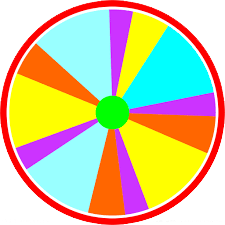
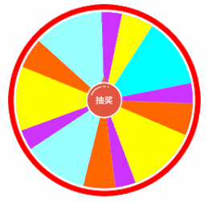
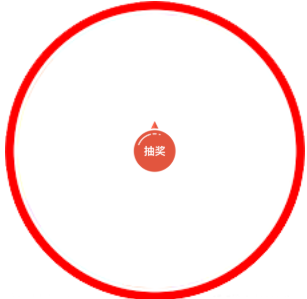
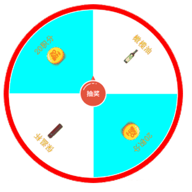

## 抽奖大转盘
抽奖大转盘，这里讲两种方式，一种是奖品内容固定的情况，一种是奖品内容不固定的情况

#### 内容固定的抽奖
内容固定抽奖这种方式很简单，由设计提供一张图片,固定转盘的奖品。类似这种：



然后怎么做那？只需要将转盘指针放在转盘中间位置，然后加上一个动画，代码如下
```
// html
 <div class="lottery">
    <div class="turntable"></div>
    <div class="arrow"></div>
</div>

// css
.lottery {
    position: relative;
    margin: 12px auto;
    width: 240px;
    height: 240px;
}

.turntable {
    height: 100%;
    width: 100%;
    background: url('./plate.png');
    background-size: contain;
    background-repeat: no-repeat;
}

.arrow {
    position: absolute;
    top: 50%;
    left: 50%;
    z-index: 1;
    margin: -24px 0 0 -24px;
    width: 48px;
    height: 48px;
    background: url('./arrow.png');
    background-size: cover;
    background-repeat: no-repeat;
}

// javascript
// 先引入jquery或zepto
$(function() {
    var deg = 0;
    var flag = false;
    $('.pointer').on('click', function() {
        if (flag) return;

        flag = true;
        deg += 1800;
        $('.turntable').css({
            'transform': 'rotate(' + deg + 'deg)',
            'transition': 'transform 6s cubic-bezier(.3, .88, .42, 1)'
        });
        $('.pointer').css({
            'background-position': '50% 0',
        });
    });

    $('.turntable').on('transitionend', function() {
        $('.pointer').css({
            'background-position': '0 0',
        });
        setTimeout(function() {
            flag = false;
        }, 100);
    });
})
```

##### 实现效果


##### 优缺点
+ 优点：实现简单，容易理解
+ 缺点：奖品内容固定，不够灵活，新增、减少奖品比较麻烦

##### 注意点
+ cubic-bezier为三次贝塞尔曲线，可在这个[网址](https://cubic-bezier.com)查看动画效果

#### 动态配置内容的抽奖
##### 1.设置抽奖边框和指针
这里使用的单位是rem,需要大家自行设置下根font-size
```
// html
<div class="turntable">
    <div class="plate">
        <div class="plate-border"></div>
        <canvas class="plate-detail"></canvas>
    </div>
    <div class="pointer"></div>
</div>

// css
.turntable {
    position: relative;
    margin: 1rem auto;
    width: 25rem;
    height: 25rem;
}

.plate {
    position: relative;
    width: 100%;
    height: 100%;
}

.plate-border {
    height: 100%;
    width: 100%;
    background-image: url('./border.png');
    background-size: cover;
    background-repeat: no-repeat;
}

.pointer {
    position: absolute;
    top: 0;
    right: 0;
    bottom: 0;
    left: 0;
    z-index: 999;
    margin: auto;
    width: 5rem;
    height: 5rem;
    background: url('./pointer.png');
    background-size: cover;
    background-repeat: no-repeat;
}
```

效果如下:


##### 2.绘制内容
然后创建扇形,就是一个循环过程，代码简单，容易理解
```
var data = [
    {
        text: '20积分',
        image: '',
        bgColor: '#00FFFF'
    },
    {
        text: '保温杯',
        image: '',
        bgColor: '#FFFFFF'
    },
    {
        text: '20积分',
        image: '',
        bgColor: '#00FFFF'
    },
    {
        text: '橄榄油',
        image: '',
        bgColor: '#FFFFFF'
    }
];
var canvas = $('.plate-detail')[0];
var borderWidth = '0.8rem'; // 图片边框的宽度

if (canvas.getContext) {
    var ctx = canvas.getContext('2d');
    var width = $(document).width() - 2 * parseInt($('.turntable').css('margin-left'));
    var radius = width / 2;
    var num = data.length;
    var arc = 2 * Math.PI / num;
    canvas.width = width;
    canvas.height = width;
    ctx.clearRect(0, 0, width, width);

    for (var i = 0; i < num; i++) {
        var start = i * arc;
        var borderImageWidthPx = otherUnitToPx(borderWidth);

        // 绘制扇形
        ctx.strokeStyle = '#fff';
        ctx.fillStyle = data[i].bgColor;
        ctx.beginPath();
        ctx.moveTo(radius, radius);
        ctx.arc(radius, radius, radius - borderImageWidthPx, start, start + arc);
        ctx.closePath();
        ctx.fill();
        ctx.stroke();
    }
}

function otherUnitToPx(data) {
    if (['rem', '%', 'px'].indexOf(data.replace(/[\d\.]/g, '')) === -1) {
        alert('请选择正确的单位：rem、%、px');
        return;
    }

    var val = parseFloat(data);
    if (data.indexOf('px') !== -1) {
        return val;
    }
    
    if (data.indexOf('rem') !== -1) {
        var htmlFontSize = $('html').css('font-size');
        
        return val * parseInt(htmlFontSize);
    }

    if (data.indexOf('%') !== -1) {
        return val * $(document).width() / 100;
    }
}
```

扇形画完就开始画文本
```
// 增加一个配置变量，文本距中心距离
var textRadius = otherUnitToPx('10rem');

// 绘制文本
ctx.save();
var currX = radius + Math.cos(start + arc / 2) * textRadius;
var currY = radius + Math.sin(start + arc / 2) * textRadius;
var rotate = start + arc / 2 + Math.PI / 2;
var text = data[i].desc;
ctx.fillStyle = '#DD9A0D';
ctx.font = 'bold 1.1rem serif';
ctx.translate(currX, currY);
ctx.rotate(rotate);
ctx.fillText(text, -ctx.measureText(text).width / 2, 8);
ctx.restore();
```

画文本时需要注意两点：

+ 调用ctx.save保存之前的状态，经过平移、旋转后，调用ctx.restore恢复之前的状态，防止平移或者旋转给后面的绘制造成影响
+ 调用ctx.measureText计算文本宽度，绘制文本时移动文本宽度的二分之一，这样文本就处于该扇形的中间位置

最后就是绘制图片，代码如下:
```
var img = new Image();
img.onload = (function(currX, currY, rotate) {
    return function () {
        ctx.save();
        ctx.translate(currX, currY);
        ctx.rotate(rotate);
        ctx.drawImage(this, -10, 15, 20, 20);
        ctx.restore();
    };  
})(currX, currY, rotate);
img.src = data[i].image;
```

绘制图片注意两点

+ ctx.drawImage需要等图片加载成功后才可以进行绘制
+ 不能画完文本后在相同位置绘制图片，因为图片异步加载，等图片加载完成时，取得的坐标、角度都不准确，所以需要在图片加载完成时重新移动画布进行绘制

最后绘制的所有代码如下：
```
var data = [
    {
        text: '20积分',
        image: './8.png',
        bgColor: '#00FFFF'
    },
    {
        text: '保温杯',
        image: './3.png',
        bgColor: '#FFFFFF'
    },
    {
        text: '20积分',
        image: './8.png',
        bgColor: '#00FFFF'
    },
    {
        text: '橄榄油',
        image: './7.png',
        bgColor: '#FFFFFF'
    }
];
var canvas = $('.plate-detail')[0];
var borderWidth = '0.8rem'; // 图片边框的宽度
var textRadius = otherUnitToPx('10rem'); // 图片边框的宽度

if (canvas.getContext) {
    var ctx = canvas.getContext('2d');
    var width = $(document).width() - 2 * parseInt($('.turntable').css('margin-left'));
    var radius = width / 2;
    var num = data.length;
    var arc = 2 * Math.PI / num;
    canvas.width = width;
    canvas.height = width;
    ctx.clearRect(0, 0, width, width);

    for (var i = 0; i < num; i++) {
        var start = i * arc;

        // 绘制扇区
        var borderImageWidthPx = otherUnitToPx(borderWidth);
        ctx.strokeStyle = '#fff';
        ctx.fillStyle = data[i].bgColor;
        ctx.beginPath();
        ctx.moveTo(radius, radius);
        ctx.arc(radius, radius, radius - borderImageWidthPx, start, start + arc);
        ctx.closePath();
        ctx.fill();
        ctx.stroke();
        ctx.save();

        // 绘制文本
        var currX = radius + Math.cos(start + arc / 2) * textRadius;
        var currY = radius + Math.sin(start + arc / 2) * textRadius;
        var rotate = start + arc / 2 + Math.PI / 2;
        var text = data[i].text;
        ctx.fillStyle = '#DD9A0D';
        ctx.font = 'bold 1.1rem serif';
        ctx.translate(currX, currY);
        ctx.rotate(rotate);
        ctx.fillText(text, -ctx.measureText(text).width / 2, 8);

        // 绘制图片
        var img = new Image();
        img.onload = (function(currX, currY, rotate) {
            return function () {
                ctx.save();
                ctx.translate(currX, currY);
                ctx.rotate(rotate);
                ctx.drawImage(this, -10, 15, 20, 20);
                ctx.restore();
            };  
        })(currX, currY, rotate);
        img.src = data[i].image;

        ctx.restore();
    }
}

// canvas默认单位是px，otherUnitToPx函数将常见的单位转换为px
function otherUnitToPx(data) {
    if (['rem', '%', 'px'].indexOf(data.replace(/[\d\.]/g, '')) === -1) {
        alert('请选择正确的单位：rem、%、px');
        return;
    }

    var val = parseFloat(data);
    if (data.indexOf('px') !== -1) {
        return val;
    }
    
    if (data.indexOf('rem') !== -1) {
        var htmlFontSize = $('html').css('font-size');
        
        return val * parseInt(htmlFontSize);
    }

    if (data.indexOf('%') !== -1) {
        return val * $(document).width() / 100;
    }
}
```

##### 3.添加动画
这里为了方便，直接使用了css动画,代码如下：
```
var $pointer = $('.turntable .pointer');
var $plateDetail = $('.turntable .plate-detail');
var flag = false;
var deg = 0;
$pointer.on('click', function() {
    if (flag) return;

    flag = true;
    deg += 1800;
    $plateDetail.css({
        'transform': 'rotate(' + deg + 'deg)',
        'transition': 'transform 6s cubic-bezier(.3, .88, .42, 1)'
    });
    $pointer.css({
        'background-position': '50% 0',
    });
});

$('.plate').on('transitionend', function() {
    $pointer.css({
        'background-position': '0 0',
    });
    setTimeout(function() {
        flag = false;
    }, 100);
});
```
最后的效果：



## 总结
实现过程中有一些注意点，比如绘制图片需要等待加载完成这些问题，但总的来说，抽奖大转盘这两种方式都还是挺简单的，最后附上代码地址：